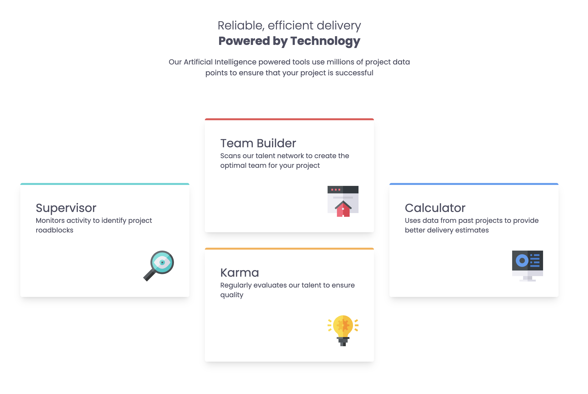

# Frontend Mentor - Four card feature section solution

This is a solution to the [Four card feature section challenge on Frontend Mentor](https://www.frontendmentor.io/challenges/four-card-feature-section-weK1eFYK). Frontend Mentor challenges help you improve your coding skills by building realistic projects.

## Table of contents

- [Overview](#overview)
  - [The challenge](#the-challenge)
  - [Screenshot](#screenshot)
  - [Links](#links)
- [My process](#my-process)
  - [Built with](#built-with)
  - [What I learned](#what-i-learned)
  - [Continued development](#continued-development)
- [Author](#author)

## Overview

### The challenge

Users should be able to:

- View the optimal layout for the site depending on their device's screen size

### Screenshot

### Links

- Solution URL: [fm-four-card-feature](https://github.com/tmykkanen/fm-four-card-feature-section-master)
- Live Site URL: [tlmfmfourcardfeature.netlify.app](https://tlmfmfourcardfeature.netlify.app/)

## My process

### Built with

- 
- 

### What I learned

- I spent a lot of time exploring layout options for CSS Grid and learned better how both grid and flexbox work.

### Continued development

- I found Tailwind more cumbersome when modifying many things with container queries. So I'd like to continue to improve my ability to use vanilla css for more and rely on tailwind for rapid prototyping.

## Author

- Website - [Github](https://github.com/tmykkanen)
- Frontend Mentor - [@tmykkanen](https://www.frontendmentor.io/profile/tmykkanen)
